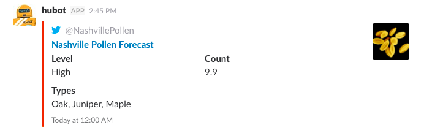

### Deprecation Notice:

This package has been deprecated in favor of [`hubot-pollen`](http://github.com/stephenyeargin/hubot-pollen), which allows you to query any US city.

---

# Hubot Nashville Pollen [](https://travis-ci.org/stephenyeargin/hubot-nashville-pollen)



Get the latest pollen forecast from @NashvillePollen.

## Installation

In hubot project repo, run:

`npm install hubot-nashville-pollen --save`

Then add **hubot-nashville-pollen** to your `external-scripts.json`:

```json
[
  "hubot-nashville-pollen"
]
```

## Sample Interaction

```
user1>> hubot pollen
hubot>> Nashville pollen level: 10.5 (High) - Juniper, Maple, Pine
```

## NPM Module

https://www.npmjs.com/package/hubot-nashville-pollen
